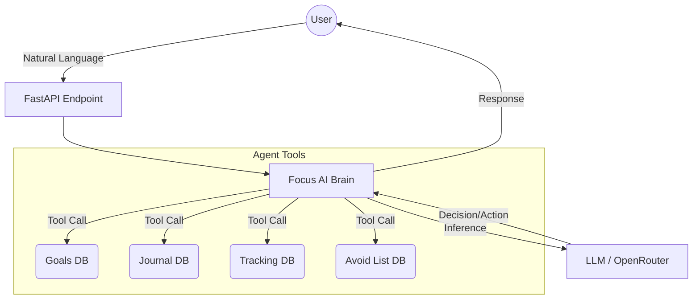

# Focus AI Agent ⚡

A powerful, natural-language AI productivity assistant designed as the backend for the **Focus** application. This AI agent allows users to manage their productivity system entirely through conversational commands, acting as a personal accountability partner and productivity manager.

## 🚀 Key Features

### 1. Natural Language Goal Management
Create, update, track, and complete your Top 3 Goals simply by talking to the agent.
- **Smart Resolution**: The agent can automatically resolve goal IDs from conversational titles (e.g., "Complete my portfolio goal").
- **Constraint Management**: Enforces the psychological rule of a maximum of 3 active goals to maintain focus.

### 2. Conversational Journaling
Write and manage your daily reflections via chat.
- Save daily reflections with auto-detected moods.
- Update existing entries without touching a form.

### 3. Dynamic Progress Tracking
Log quantifiable metrics for your active goals effortlessly.
- *Example*: "I applied to 5 jobs today for my career goal." 
- The agent automatically attributes the metrics to the correct underlying goal.

### 4. The "Avoid" List Enforcer
Manage distractions actively. Tell the agent what you need to avoid today, and report back later to mark your success.

## 🛠️ Tech Stack

- **Framework**: [FastAPI](https://fastapi.tiangolo.com/) for high-performance API routing.
- **AI Engine**: Custom Agent Framework wrapping OpenAI-compatible models via [OpenRouter](https://openrouter.ai/).
- **Data Validation**: [Pydantic](https://docs.pydantic.dev/) for robust schema definitions and tool context.
- **Async Runtime**: Python `asyncio` for non-blocking database and API operations.
- **Dependency Management**: `uv`

## ⚙️ Project Architecture



## 🏁 Getting Started

### 1. Prerequisites
- Python 3.10+
- A Neon PostgreSQL Database (shared with the Focus Next.js Frontend)
- OpenRouter API Key (or OpenAI API Key)

### 2. Installation

Clone the repository and navigate to the agent directory:
```bash
git clone <repository-url>
cd focus-ai-agent
```

Install dependencies (using `uv` is recommended):
```bash
uv sync
# OR
pip install -r requirements.txt
```

### 3. Environment Variables

Create a `.env` file in the root directory:
```env
OPENROUTER_API_KEY=your_openrouter_api_key
MODEL=openai/gpt-4o-mini # Or your preferred model
DATABASE_URL=your_postgresql_connection_string
```

### 4. Running the Agent Server

Start the FastAPI development server:
```bash
uvicorn main:app --reload --port 8000
```

The API documentation will be available at [http://localhost:8000/docs](http://localhost:8000/docs).

## 🔗 Integration with Frontend

This agent is designed to run in tandem with the **Focus Next.js App**. The frontend communicates with this backend service to provide the seamless chat interface overlay in the premium user dashboard.

---

Built with precision for the next generation of productivity.
